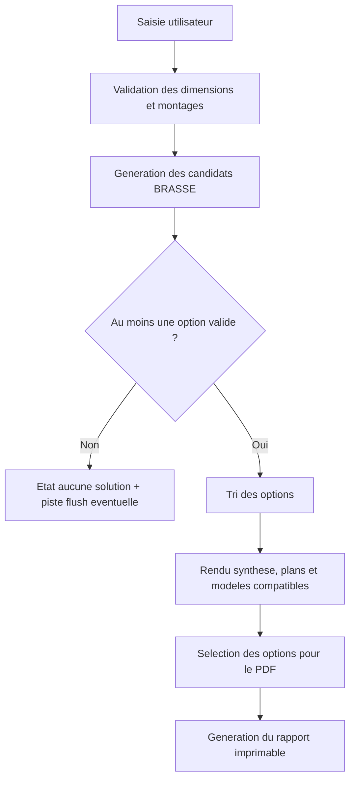

# Guide technique developpeur

Ce document aide a comprendre le fonctionnement interne de l'outil et a retrouver rapidement les zones de code a modifier. Il complete le `README.md`, qui reste volontairement centre sur le demarrage rapide.

## Vue d'ensemble

L'application est un site statique. Au runtime, `index.html` charge les feuilles CSS de `styles/` et le bundle navigateur `dist/app.browser.js`. Les sources maintenables sont les modules ES dans `src/`; le fichier `dist/app.browser.js` est genere par `npm run build:browser`.

Le projet n'utilise pas de serveur applicatif, pas de base de donnees et pas de stockage distant. Les calculs, le catalogue BRASSE II, le rendu SVG et l'export PDF sont executes cote navigateur.

Regle pratique importante : apres une modification dans `src/`, il faut regenerer `dist/app.browser.js` avant de tester l'ouverture directe de `index.html`.

## Architecture du code

`src/main.js` orchestre l'application : lecture des inputs, validation, calcul des candidats, rendu des resultats, interactions du catalogue, selection des options PDF et export.

`src/app/` contient les references DOM et l'etat applicatif partage. `state.js` porte notamment `latestReportState` et la selection des options exportees.

`src/core/` contient le code metier sans dependance DOM :

- `calepinage.js` genere les trames BRASSE, calcule les diametres, le FCC, les contraintes de hauteur et le tri principal.
- `brasse2.js` relie une option de calepinage aux modeles BRASSE II compatibles et choisit les modeles mis en avant.
- `catalog.js` filtre et trie le tableau catalogue complet.
- `messages.js`, `formatters.js` et `constants.js` centralisent les messages, formats et constantes.

`src/ui/` genere le HTML et les SVG de l'interface. Le code UI recoit des objets deja calcules et ne doit pas porter de regle metier lourde.

`src/report/pdf.js` genere une page HTML dediee au rapport PDF, ouverte dans une fenetre d'impression.

`data/brasse2-data.js` expose les donnees BRASSE II en module ES. `brasse2-data.js` reste le jeu de donnees source utilise par le bundle classique.

## Cycle de calcul



Le rendu initial est declenche a la fin de `src/main.js`. Ensuite, le formulaire relance `render()` au submit et certains inputs relancent aussi le calcul sur changement.

## Regles metier principales

La fonction centrale est `evaluateCandidate(room, nx, ny, mountMode, realDiameters)` dans `src/core/calepinage.js`.

Pour une trame `nx x ny`, le local est decoupe en cellules uniformes :

- `cellLength = room.length / nx`
- `cellWidth = room.width / ny`
- `cellArea = cellLength * cellWidth`
- `formFactor = grand_cote / petit_cote`

Les bornes de diametre sont derivees de la geometrie de la cellule :

- minimum FCC : `0.2 * sqrt(cellArea)`
- maximum FCC : `0.4 * sqrt(cellArea)`
- distance mur : le centre est au milieu de la cellule, donc `D` ne doit pas depasser `cellShort / 2`
- entraxe : quand il y a plusieurs brasseurs, l'entraxe doit rester superieur a `2.5 D`

Les contraintes de hauteur sont calculees par `buildHeightFeasibility()`. Le montage fournit un facteur de distance plafond-pales :

- `standard` : `0.35 D`
- `low-profile` : `0.25 D`
- `flush` : `0.15 D`, seulement comme piste de secours

La hauteur sous pales est `room.height - mountFactor * D`. Les petits brasseurs et grands brasseurs utilisent les seuils definis dans `src/core/constants.js`.

Les diametres reels viennent exclusivement des diametres presents dans la base BRASSE II. `getCompatibleRealDiameters()` conserve les diametres qui tombent dans les intervalles admissibles et dont le `FCC reel = D / sqrt(cellArea)` reste dans `[0.2 ; 0.4]`.

Le tri des options est defini par `compareCandidates()` :

- plus grand diametre reel retenu
- facteur de forme le plus proche de `1`
- FCC reel le plus proche de `0.4`
- montage `standard` avant `low-profile`
- moins de brasseurs a egalite

Le fallback `flush` est calcule par `getFallbackFlushCandidate()` uniquement si aucun cas `standard` ou `low-profile` ne passe.

## Catalogue BRASSE II

`src/core/brasse2.js` est le point d'entree pour relier les options de calepinage aux modeles BRASSE II.

`getBrasse2ModelsForCandidate(candidate, brasse2Models)` retourne tous les modeles dont le diametre est dans `candidate.compatibleRealDiameters`. Ce filtrage ne se limite pas au diametre retenu : il inclut aussi les diametres BRASSE II admissibles pour l'option.

Chaque modele compatible recoit des champs calcules :

- `compatibleOption` : diametre admissible et FCC associe
- `mountFits` : compatibilite rapide entre la distance plafond/BA du modele et la distance visee par le montage
- `mountDeltaCm` : marge en centimetres
- `isSelectedDiameter` : indique si le modele correspond au diametre retenu

Les cartes de modeles sont produites par `buildModelPicks()` :

- `FCC` : plus fort FCC reel, avec departage par confort
- `Confort` : meilleur `CE direct debout Vmax`, puis bruit, puis puissance
- `Efficacite` : meilleur `CFE direct debout Vmax`, puis bruit, puis confort
- `Acoustique` : plus faible `LwA Vmax`, puis confort, puis puissance

Le catalogue complet en bas de page utilise `src/core/catalog.js` pour les filtres et tris, puis `src/ui/catalog.js` pour le rendu.

## Rendu des resultats et plans

`src/ui/results.js` construit les cartes d'options, les syntheses, les avertissements, les tableaux de modeles compatibles et les interactions de filtrage des modeles sous chaque option.

`src/ui/planSvg.js` dessine les plans. Il affiche :

- la piece
- le quadrillage de cellules
- les brasseurs
- les cotes principales

Pour modifier le dessin sans changer le calcul, travailler dans `planSvg.js`. Pour modifier la position des centres ou les contraintes de pose, travailler dans `calepinage.js`.

## Rapport PDF

L'export PDF est genere par `src/report/pdf.js`. Il ne reutilise pas directement la page de l'outil : il construit un document HTML dedie au format rapport, puis ouvre l'impression navigateur.

Les options exportees viennent de `latestReportState.selectedOptionKeys`. Les cases `Inclure dans le PDF` sont gerees par `src/app/state.js` et par les listeners de `src/main.js`.

Pour modifier le contenu du rapport, intervenir dans les fonctions de rendu de `pdf.js`. Pour modifier seulement l'apparence du rapport, intervenir dans `buildPdfReportStyles()` dans le meme fichier.

Le rapport doit rester coherent avec les options reellement affichees dans l'interface.

## Contrats de donnees importants

`room` :

```js
{
  length: number,
  width: number,
  height: number
}
```

`candidate` represente une option affichee ou exportable. Les champs les plus utilises sont :

```js
{
  key: string,
  nx: number,
  ny: number,
  fanCount: number,
  room,
  mountMode,
  diameter: number,
  theoreticalMaxDiameter: number,
  coverageFactor: number,
  formFactor: number,
  wallClearance: number,
  interFanSpacing: number | null,
  compatibleRealDiameters: Array,
  coordinates: Array<{ x: number, y: number }>
}
```

`compatibleRealDiameters` :

```js
[
  {
    diameter: number,
    fanClass: "small" | "large",
    coverageFactor: number
  }
]
```

`latestReportState` :

```js
{
  kind: "uniformity-ok" | "uniformity-empty" | "invalid",
  simulationName: string,
  room,
  candidates?: Array<candidate>,
  selectedOptionKeys?: Array<string>,
  modesLabel: string,
  generatedAt: Date,
  context: string
}
```

## Ou modifier quoi ?

Changer une regle de calepinage : `src/core/calepinage.js`.

Changer le tri des options : `compareCandidates()` dans `src/core/calepinage.js`.

Changer les constantes metier : `src/core/constants.js`.

Changer la selection des modeles compatibles : `src/core/brasse2.js`.

Changer le catalogue complet : `src/core/catalog.js` pour la logique, `src/ui/catalog.js` pour le rendu.

Changer le plan SVG des options : `src/ui/planSvg.js`.

Changer les cartes de resultats : `src/ui/results.js`.

Changer le rapport PDF : `src/report/pdf.js`.

Ajouter un champ de formulaire : modifier `index.html`, ajouter la reference dans `src/app/dom.js`, lire la valeur dans `src/main.js`, puis ajouter des tests si le champ influence un calcul ou un rendu exporte.

Ajouter un module JS source : l'ajouter aussi a `scripts/build-browser-bundle.mjs`, sinon `dist/app.browser.js` ne contiendra pas le code en ouverture directe du HTML.

## Pieges connus

Ne pas modifier directement `dist/app.browser.js`. Il est genere et sera ecrase par `npm run build:browser`.

Apres toute modification de `src/`, lancer `npm run build:browser` ou `npm run check` avant de tester dans le navigateur.

Si le site fonctionne via les imports ES mais pas en ouvrant `index.html`, verifier que le nouveau module est bien liste dans `scripts/build-browser-bundle.mjs`.

Garder les calculs purs dans `src/core/`. Les modules `core` ne doivent pas acceder au DOM.

Le navigateur peut garder un ancien bundle en cache pendant les tests. En cas de comportement incoherent, faire un rechargement force.

## Tests et validation

Commandes utiles :

```bash
npm run dev
npm run test
npm run lint
npm run build:browser
npm run check
```

Ajouter les tests au bon endroit :

- `test/calepinage.test.js` pour les regles BRASSE, la hauteur, les diametres et le tri des options.
- `test/catalog-brasse2.test.js` pour les modeles compatibles, le catalogue, la selection PDF et le contenu du rapport.

Avant de proposer une modification, viser au minimum `npm run check`. Pour une modification purement documentaire, il suffit de verifier les liens et la lisibilite du Markdown.

## Sources externes et prudence metier

L'outil applique des regles issues du guide BRASSE et exploite une extraction BRASSE II embarquee. Toute modification de regle doit distinguer clairement :

- ce qui vient directement du guide
- ce qui est une interpretation technique du site
- ce qui est une aide non normative

Cette distinction est importante pour garder l'outil utile sans lui faire porter une validation officielle qu'il n'a pas.
